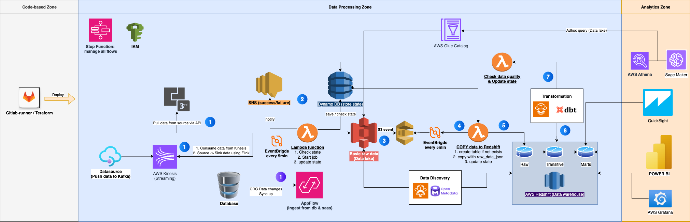
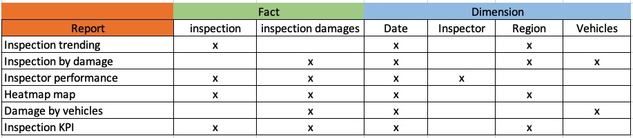
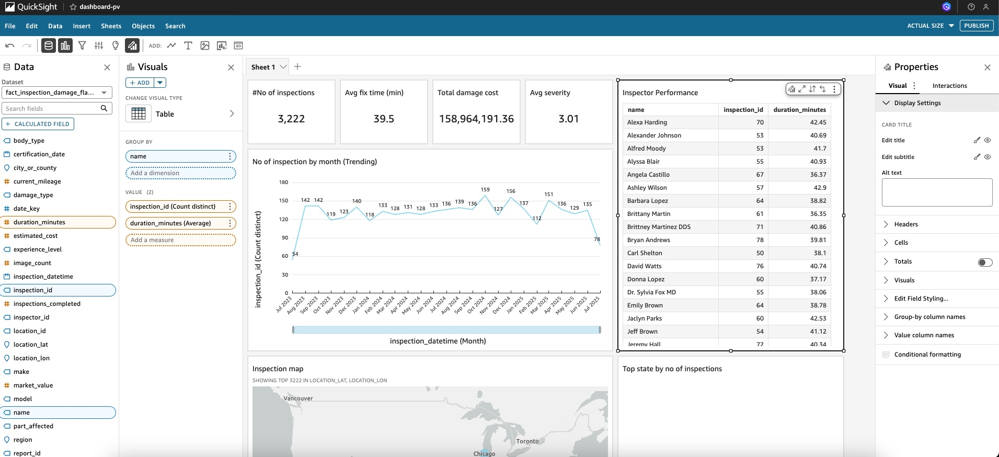
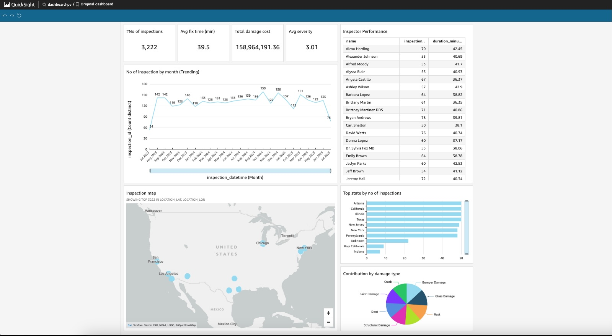
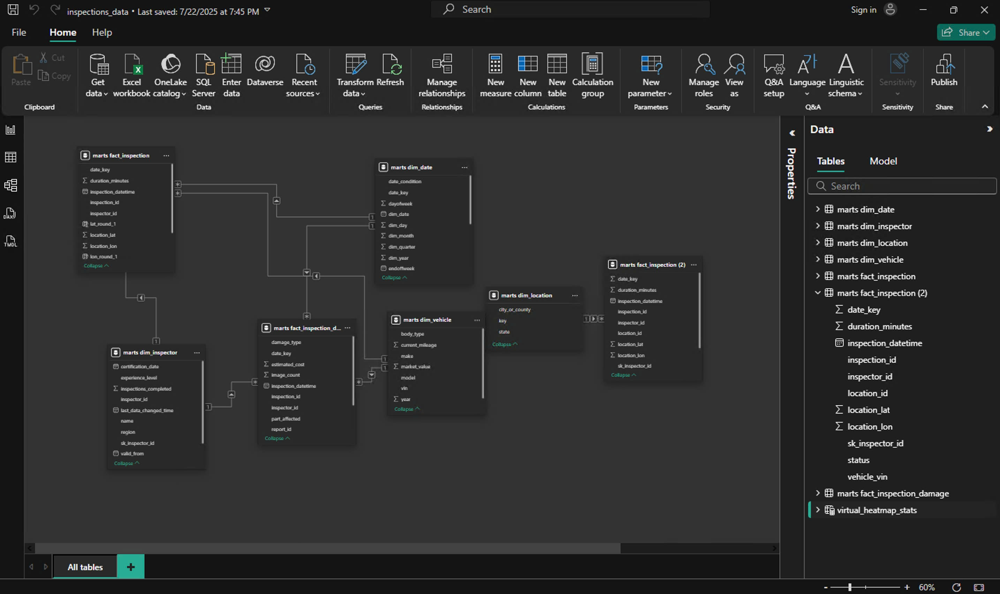
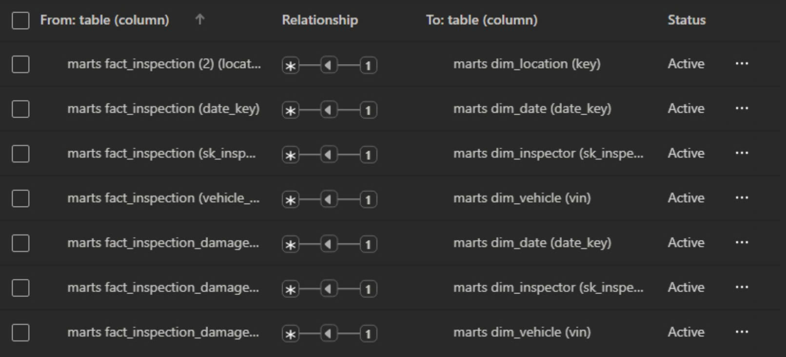
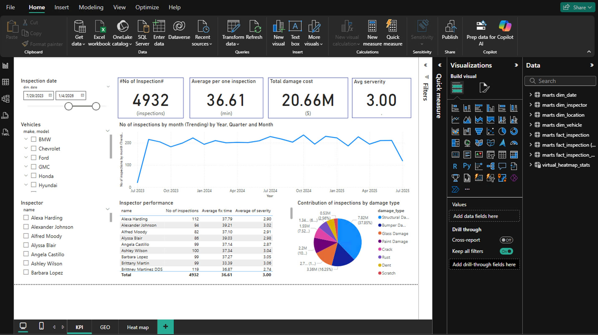
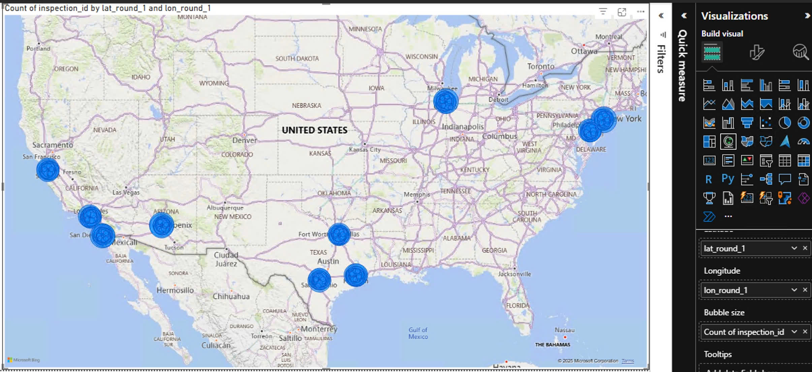
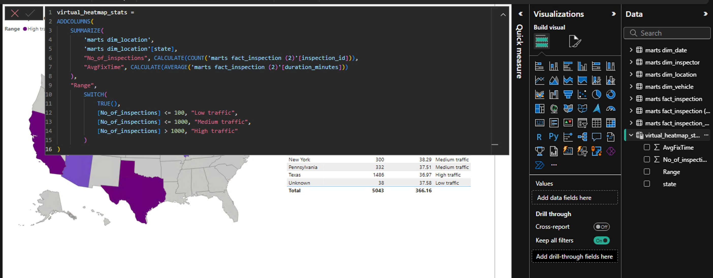
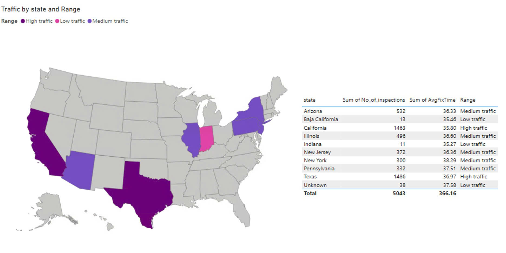

# Part 1: Data Pipeline Design
Design a scalable ETL pipeline architecture on AWS. Create:
- Data ingestion from mobile apps/APIs
- Transformation layers
- Storage solutions (S3, Redshift)
- BI/visualization layer
- Real-time vs batch processing paths

## 1. Solution justification
### 1.1 Overview:
Design the lightweigth but feature-enough system that is scalable and integrated-ready to use ML in the future. Costly & ease of maintanence.

### 1.2 data ingestion: 
- Proactive pushing agent (iot, mobile): Aws kinesis is the interface that earn the realtime request, then aws flink will stream source->sink to the s3.
- Pulling data (rest api): Lambda Functions & eventbridge will crawl (pull) data by schedule.
- Callback rest api: AWS Api gateway + lambda will handle callback api -> then send to kinesis -> flink will stream source->sink to the s3.

### 1.3 Design Datalake
We can use AWS S3 as a datalake, notice that we don't ingest directly to warehouse, cause we can use this datalake for ML later and we can see it like a staging erea before processing before moving to the structured data warehouse as well.

#### 1.3.1 manage data lake metadata: 
cause the data on s3 is untructure data or structure data files without DDL. So that, we need to have data catalog to defined data for quering later (query from athena / redshift / glue ...)

#### 1.3.2 adhoc query
we can use aws athena for make adhoc query, or use athena as a datasource in BI Tool (Quicksight / PowerBI)

#### 1.3.3 adhoc data transformation: 
aws glue make a transformation by using spark code (from s3 files to s3 files)

####  1.3.4 build lakehouse on s3: 
aws glue & aws athena already support iceberg, then we can build lakehouse via create iceberg table via glue / athena.

#### 1.3.5 data analytics: 
aws sagemaker can connect to s3 directly, or via glue catalog to query / process / analyze data.

### 1.4 The main data warehouse
Beside building datalake for many geneal purposes, we also need to build a stureture datawarehouse to make it clear and easy to provice a friendly data-driven system to end users, help them understand the data and do self-service reports without DA, DE. 

#### 1.4.1 Load data to warehouse (source-sink lake to dwh): 
S3 event + SQS + lambda to load to redshift, we don't make this process complicated, just create table in redshift with the same path of s3 and the same header metadata with all string data type, then copy all data to redshift => so that, we just make the same common code for all tables, no need to sync data case by case.

#### 1.4.2 Data warehouse (physical layer): 
Redshift is the native solution for data warehouse on aws (notice: we can also consider Clickhouse Cloud on aws marketplace as well: costly & faster than Redshift for most of the task)

#### 1.4.3 Design data pipeline & data model:
- Design data model on Redshift with the standard transformation: (raw schema (copy origin data from s3) -> trantitive schema (enriched) -> mart schema). 
- Using the design of star schema of KimBall as a dimensional modelling with some fact tables and some dim tables , we need to create the transformation process to transform data from schema raw to mart, then use mart schema for visulization.

#### 1.4.4 data transformation:
- The trending of data transformation now is to give this process to data warehouse to transform data via sql statement. Data warehouse will arrange and optimize the best effort to transform data the most effectively cause all data and all process will run on the physical datawarehouse area, rather than the old method: load data from source schema -> process on memory -> write it to dest schema: expensive. 
- So that, we can send sql to data warehouse to run query via dbt tools. This tool is easy to learn and cause it use sql for transformation so that DA can help DE to transform data easily. DA is closer to business than DE, so that this solution can help to build new data pipeline fastly. Also, DA can be proactive to make new transformation when they write sql code and commit to brand, no need for setting new data process, dbt run can do all logical jobs in 1 time.
- Sum up, we use dbt & deploy on Fargate to launch transformation via run this command: dbt seed && dbt run && dbt artifacts

#### 1.4.5 data validation:
- dbt supports many validation solution: check by regex, check duplicate, constraint ... and write result to data warehouse directly
- dbt supports check data freness, data profile and write result to data warehouse directly

### 1.5 Visualization
- We need to have a BI tool for visualization purpose. Aws has Quicksight, but one of the weakness is lack of advance BI features, especially data modelling, virtual table, complex measure, dynamic programming and lack of complex charts, comparing to other market leader such as powerbi, tableau, holistic or even apache superset.
- Data modelling: Quicksight doesnt support data modelling so that we can levarage the power of dimensional data models. If we use Quicksight, all we need is to make a view on redshift to pre join all dimension to fact and query on one table.
- In the demo, I give you an option of PowerBI for you to consider. Powerbi is the market leader of BI Tools, that provide a lot of features to build all type of charts, support dynamic reports via DAX programming, enabling AI support via Copilot.

### 1.6 Pipeline orchestration: 
we can use Steps Function to arrange and manage data pipeline.

### 1.7 Data catalog: 
We also need to have data catalog for Data Pipeline explaination, dbt docs, Business Glossary, Tagging, Data profiling ... In general, we can do that by run dbt test / dbt generate docs / dbt run profilling and see the reports on Redshift directly. However, to make it easy on UI, and no need to run dbt, web can also consider build a data catalog system like openmetadata and run it on EC2 or Fargate or EKS.

### 1.8 Realtime data monitoring: 
We can use grafana to query data and show realtime on AWS Managed Grafana.

### 1.9 Notification services: 
Use AWS SNS

### 1.10 Logging: 
AWS Cloudwatch

### 1.10 CI & Deployment: 
consider gitlab-ci + teraflow

###  1.11 Security with IAM, Keyvault, masking data ...

## 2. Architect diagram
Based on the solution justification above, we make a diagram of data platform architecture 



# Part 2 - Transformation Pipeline

## 2.1. Data Quality Checks
- Validate VIN formats

Validate by selecting the fail cases. Check code at: [pv_dwh/models/validations/vld_vinformat.sql](pv_dwh/models/validations/vld_vinformat.sql)

```
SELECT *
FROM {{ ref('fact_inspection') }}
WHERE vehicle_vin IS NULL
   OR LENGTH(vehicle_vin) != 17
   OR vehicle_vin ~ '[^A-Z0-9]';
```

Validate via dbt test. Check code at: [pv_dwh/models/schema.yml](pv_dwh/models/schema.yml)

```
- name: fact_inspection
  tests:
    - dbt_expectations.expect_column_values_to_match_regex:
        column: vehicle_vin
        regex: '^[A-Z0-9]{17}$'
```

- Check for missing critical fields

Validate by selecting the fail cases

Check code at: [pv_dwh/models/validations/vld_missing_fields.sql](pv_dwh/models/validations/vld_missing_fields.sql)

- Identify duplicate inspections

Validate by selecting the fail cases

Check code at: [pv_dwh/models/validations/vld_duplication.sql](pv_dwh/models/validations/vld_duplication.sql)

- Flag anomalous inspection durations

Validate by selecting the fail cases

Check code at: [pv_dwh/models/validations/vld_anomalous_durations.sql](pv_dwh/models/validations/vld_anomalous_durations.sql)

## 2. Create fact and dimension tables following star schema
Depend on the requests of data usage, we need to design an enterprise bus matrix (EBM) to explore them via related dimensions & facts. From this EBM, we can indicates the suitable dimension & fact.



### Fact Inspections
- Dim Date
- Dim Vehicles 
- Dim Inspector
- Dim Region
- Duration

Check code at: [pv_dwh/models/marts/fact/fact_inspection.sql](pv_dwh/models/marts/fact/fact_inspection.sql)

### Fact Inspections Damage
- Dim Date
- Dim Vehicles 
- Dim Inspector
- Dim Region
- Cost 

Check code at: [pv_dwh/models/marts/fact/fact_inspection_damage.sql](pv_dwh/models/marts/fact/fact_inspection_damage.sql)


## All dimension tables:

###  Dim Date
Check code at: [pv_dwh/models/marts/dim/dim_date.sql](pv_dwh/models/marts/dim/dim_date.sql)

###  Dim Vehicles 
Check code at: [pv_dwh/models/marts/dim/dim_vehicle.sql](pv_dwh/models/marts/dim/dim_vehicle.sql)

###  Dim Inspector => see 2.2 to know more how to design SCD type 2.
Check code at: [pv_dwh/models/marts/dim/dim_inspector.sql](pv_dwh/models/marts/dim/dim_inspector.sql)

###  Dim Region
Check code at: [pv_dwh/models/marts/dim/dim_region.sql](pv_dwh/models/marts/dim/dim_region.sql)

- In case dim region, we need to build region (state / city) by reverse from coordination value from inspection data, and create new table in dim_location with location, city, state

```
with open(output_file, mode='a', newline='', encoding='utf-8') as f:
    writer = csv.DictWriter(f, fieldnames=["lat", "lon", "city_or_county", "state"])

    for lat, lon in coords:
        try:
            url = f"https://nominatim.openstreetmap.org/reverse?format=jsonv2&lat={lat}&lon={lon}&addressdetails=1"
            headers = {"User-Agent": "geo-reverse-agent"}
            r = requests.get(url, headers=headers, timeout=10)
            r.raise_for_status()

            address = r.json().get("address", {})
            city = (
                address.get("city")
                or address.get("town")
                or address.get("village")
                or address.get("county")
                or "Unknown"
            )
            state = address.get("state", "Unknown")

            row = {"lat": lat, "lon": lon, "city_or_county": city, "state": state}
            writer.writerow(row)
            print(f"✓ {lat},{lon} -> {city}, {state}")

        except Exception as e:
            print(f"✗ Error at {lat},{lon}: {e}")

        time.sleep(0.5)
```

### Build the models and run

- 1. Install DBT and DBT for Redshift

```
pip install dbt-core dbt-redshift
```

- 2. Install dbt dependencies

```
dbt deps
```

- 3. Run dbt seed to load dataset

```
dbt run --profile pv_dwh --target raws --profiles-dir profiles
```

- 4. Run dbt for making enriched data

```
dbt run --profile pv_dwh --target transitives --profiles-dir profiles --select models/transitives
```

- 5. Run dbt to build final data marts

```
dbt run --profile pv_dwh --target marts --profiles-dir profiles --select models/marts
```


### 2.2 Implement slowly changing dimensions for inspector data
Follow the design of SCD type 2 of Kimball (Chapter 5 Datawarehouse toolkit), we have 2 cases:

I. If new comming data is not changes compared to existing data in Dim inspector: do nothing

II. If data changes:
- Add new row to table dim_inspectors that records the new data, including valid time for new line
- Create supporate key sk_inspector_id (inspector_id, valid_from) instead of inspector_id
- Insert sk_inspector_id in Fact Inspections and Fact Inspection Damage
- There are 2 type of new changes: new record & changed existing record

For new record, we have the code:

```
WITH snapshot AS (
    SELECT * FROM raw.inspectors i 
),
current AS (
    SELECT * FROM marts.dim_inspector_scd
)
SELECT 
    s.inspector_id,
    s.name,
    s.region,
    s.experience_level,
    CAST(s.certification_date AS DATE) AS certification_date,
    s.inspections_completed,
    '2000-01-01' AS valid_from,
    '3000-12-31'::timestamp AS valid_to,
    NOW() AS last_data_changed_time
    FROM snapshot s
    LEFT JOIN current c ON s.inspector_id = c.inspector_id
    WHERE c.inspector_id IS null;
```

For changed existing record:

```
SELECT
    r.inspector_id,
    r.name,
    r.region,
    r.experience_level,
    CAST(r.certification_date AS DATE) AS certification_date,
    r.inspections_completed,
    NOW() AS valid_from,
    '3000-12-31'::timestamp AS valid_to,
    NOW() AS last_data_changed_time
FROM raw.inspectors r
JOIN marts.dim_inspector_scd d
    ON r.inspector_id = d.inspector_id
WHERE r.name IS DISTINCT FROM d.name OR
      r.region IS DISTINCT FROM d.region OR
      r.experience_level IS DISTINCT FROM d.experience_level OR
      CAST(r.certification_date AS DATE) IS DISTINCT FROM d.certification_date OR
      r.inspections_completed IS DISTINCT FROM d.inspections_completed

Then, merge to existing Dim Inspectors:
select 
    inspector_id,
    name,
    region,
    experience_level,
    certification_date,
    inspections_completed,
    valid_from,
    valid_to,
    last_data_changed_time
FROM marts.dim_inspector_scd
UNION ALL
SELECT 
    inspector_id,
    name,
    region,
    experience_level,
    certification_date,
    inspections_completed,
    valid_from,
    valid_to,
    last_data_changed_time
FROM transitive.inspector_new_snapshot
UNION ALL
SELECT
    inspector_id,
    name,
    region,
    experience_level,
    certification_date,
    inspections_completed,
    valid_from,
    valid_to,
    last_data_changed_time
FROM transitive.inspector_update
```

Next, we create sk_inspector_id and adjust the valid_from & valid_to that indicates the changed time of a record

```
WITH ordered_versions AS (
    SELECT
        *,
        LEAD(valid_from) OVER (
            PARTITION BY inspector_id
            ORDER BY valid_from ASC
        ) AS next_valid_from
    FROM transitive.dim_inspector_all_changes
)
SELECT
    inspector_id || '---' || md5(
        inspector_id || '|' || name || '|' || region || '|' ||
        experience_level || '|' || certification_date || '|' ||
        inspections_completed || '|' || valid_from
    ) AS sk_inspector_id,
    inspector_id,
    name,
    region,
    experience_level,
    certification_date,
    inspections_completed,
    valid_from,
    COALESCE(next_valid_from, '9999-12-31'::timestamp) AS valid_to,
    last_data_changed_time
FROM ordered_versions;
```

Finally, update related fact: Fact inspection & Fact inspection damages to point to correct inspector record

```
SELECT
    i.inspection_id,
    d.sk_inspector_id,
    i.vehicle_vin,
    i.inspector_id,
    CAST(i.inspection_date AS timestamp) AS inspection_datetime,
    TO_CHAR(CAST(i.inspection_date AS timestamp), 'YYYYMMDD')::int AS date_key,
    i.status,
    i.duration_minutes,
    i.location_lat,
    i.location_lon
FROM raw.inspections i
LEFT JOIN marts.dim_inspector d
  ON i.inspector_id = d.inspector_id
 AND CAST(i.inspection_date AS timestamp) >= d.valid_from
 AND CAST(i.inspection_date AS timestamp) <  d.valid_to;
```

### - Calculate derived metrics:
Actually, when we design a enough good data modelling, these sql can be generated naturally via BI Tool (by dropping & dragging dimension & metric). However, to resolve this request, we also provide the sql by following:

#### + Average damage cost by vehicle type
Check code at: [pv_dwh/models/adhoc_analysis/avg_damage_costs.sql](pv_dwh/models/adhoc_analysis/avg_damage_costs.sql)

#### + Inspector performance scores
Check code at: [pv_dwh/models/adhoc_analysis/avg_damage_costs.sql](pv_dwh/models/adhoc_analysis/avg_damage_costs.sql)

#### + Geographic damage patterns
Check code at: [pv_dwh/models/adhoc_analysis/geographic_heatmap.sql](pv_dwh/models/adhoc_analysis/geographic_heatmap.sql)

#### + Time-based inspection trends
Check code at: [pv_dwh/models/adhoc_analysis/monthly_trendings.sql](pv_dwh/models/adhoc_analysis/monthly_trendings.sql)

# Part 3: Analytics & Visualization (35 points)
## 1. SQL Analytics Queries Write optimized queries for:
Again, we don't need to make this query cause we can make the report via using BI Tools. But, following the requirement, we still make sql for this query:
- Top 10 most common damage types by vehicle make
- Inspector efficiency metrics (inspections/day, accuracy rates)
- Monthly trending of inspection volumes and damage costs
- Geographic heatmap data for damage severity

## 2. QuickSight Dashboard Mock-up
I already mentioned in part 1, Quicksight is not good to build visualization with native star schema. So I use powerbi to build relationship and some visualization you want

Create a dashboard design (use any tool/framework), Include at least 5 visualizations:
- KPI cards for key metrics: use KPI chart as below
- Time series of inspection volumes: use line chart as below
- Geographic distribution map: use Map chart as below
- Inspector performance leaderboard: use table chart as below
- Damage cost breakdown by category: use pie chart as below

### 2.1 Option 1: Use Quicksight with pre join data models (flatten fact)
We need to make a view of prejoin fact. See code on [pv_dwh/models/marts/fact/fact_inspection_damage_flat_v.sql](pv_dwh/models/marts/fact/fact_inspection_damage_flat_v.sql) 

Then use use only one table fact_inspection_damage_flat_v to make visualization as below





### 2.2 Option 1: Use PowerBI, that supports data modelling for star schema
- Create relationship on Powerbi from existing data marts



- Then we build the slicer & related charts



- For heatmap map by state: we need to build a virtual table to support render fillmap (heatmap map) as below



You can find PowerBI file at [visualization/inspections_data.pbix](visualization/inspections_data.pbix)

## 3. Real-time Monitoring Queries
### Design queries for operational dashboards: We can use Grafana and write sql to get live records from Redshift as below:
- Live inspection count (last hour) => see sql in source code [pv_dwh/models/adhoc_analysis/live_inspection_count.sql](pv_dwh/models/adhoc_analysis/live_inspection_count.sql)
- Queue depth by region [pv_dwh/models/adhoc_analysis/queue_depth_by_region.sql](pv_dwh/models/adhoc_analysis/queue_depth_by_region.sql)
- Failed inspection alerts [pv_dwh/models/adhoc_analysis/failled_alerts.sql](pv_dwh/models/adhoc_analysis/failled_alerts.sql)